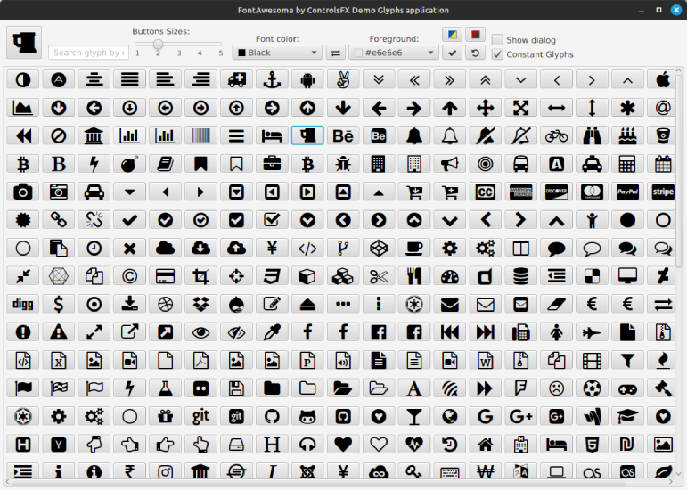
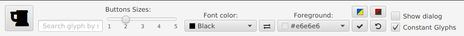

## FontAwesome Glyphs Demo application
### _ControlsFX FontAwesome Glyph viewer_

  

### 💡 Purpose
To demonstrate how ControlsFX FontAwesome Glyphs can be used
### 📃 Features
 - multiple OS
 - all controls in one page
 - able to search controls by its name
 - customizable control's font color and background
### ⏬ Getting
You can download archive from [Releases section](https://github.com/anrydas/glyps/releases) or clone the repository. Release includes JavaFX runtime library.
Select FontAwesomeDemo_v.X.Y-distribute.zip for OS Windows and FontAwesomeDemo_v.X.Y-distribute.tar.gz for OS Linux
### 🚀 Launch<a id='Launch'/>
The application's distribution included run.cmd or run.sh depended on your OS. Just launch it.
Note: run.* script need to `JAVA_HOME` environment variable. If it doesn't provide made changes into script to provide full path to JRE.
### 📜 Main Window<a id='MainWin'/>

#### Note: For Linux and Windows used different controls to showing glyphs, so appearance may vary slightly. Image above from Linux OS.
### 📄 Application Menu<a id='AppMenu'/>

1. **Demo button** - appears if glyph  was clicked in glyphs field. Shows glyph as it looks like on button.
   Mouse **Click** - to copy Glyph's name to system clipboard
   **Ctrl + Click** - to remove this button
2. **Search Glyph by its name** field - start typing glyph's name to find it.
   Press **Enter** key - to activate selected / found glyph
   Press **Esc** key - to clear field and remove **Demo button**
3. **Button sizes** in glyphs field. Glyph's field will change according to selected value.
4. Glyph's **Font color** - used to change glyph's color in glyphs field. Glyph's field will change according to selected value.
5. **Colors exchange button** - exchanging foreground and background colors
6. Glyph's **Background color** - used to change glyph's background color in glyphs field. Glyph's field will change according to selected value.
7. **Color buttons block**:
   1. **Ukrainian flag colors** - applies UA flag colors as foreground and background colors.
   2. **OUN UPA flag colors** - applies OUN UPA (Red and Black) flag colors as foreground and background colors.
   3. **Apply current colors button** - applies currently selected colors.
   4. **Apply default colors** - applies default (black and #e6e6e6 like gray) colors.
8. **Options block**:
   1. **Show dialog option** - if checked, shows dialog with glyph's information when clicked in glyph's field.
   2. **Constant glyphs amount option** - if checked, the constant glyphs amount will be shown in the row when glyph's size have changed. Otherwise, glyph's amount will be changed from row to row
###### _Made by -=:dAs:=-_