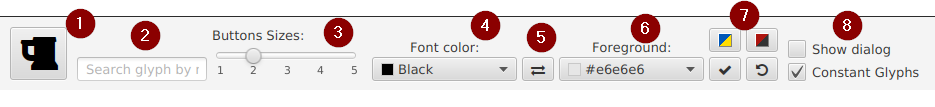

## FontAwesome Glyphs Demo application
### _ControlsFX FontAwesome Glyph viewer_

  

### 💡 Purpose
To demonstrate how ControlsFX FontAwesome Glyphs can be used
### 📃 Features
 - multiple OS
 - all controls in one page
 - able to search controls by its name
 - customizable control's font color and background
### ⏬ Getting
You can download archive from [Releases section](https://github.com/anrydas/glyps/releases) or clone the repository. Release includes JavaFX runtime library.
Select FontAwesomeDemo_v.X.Y-distribute.zip for OS Windows and FontAwesomeDemo_v.X.Y-distribute.tar.gz for OS Linux
### 🚀 Launch<a id='Launch'/>
The application's distribution included run.cmd or run.sh depended on your OS. Just launch it.
Note: run.* script need to `JAVA_HOME` environment variable. If it doesn't provide made changes into script to provide full path to JRE.
### 📜 Main Window<a id='MainWin'/>

#### Note: For Linux and Windows used different controls, so appearance may vary slightly. Image above from Linux OS.
### 📄 Application Menu<a id='AppMenu'/>

###### _Made by -=:dAs:=-_